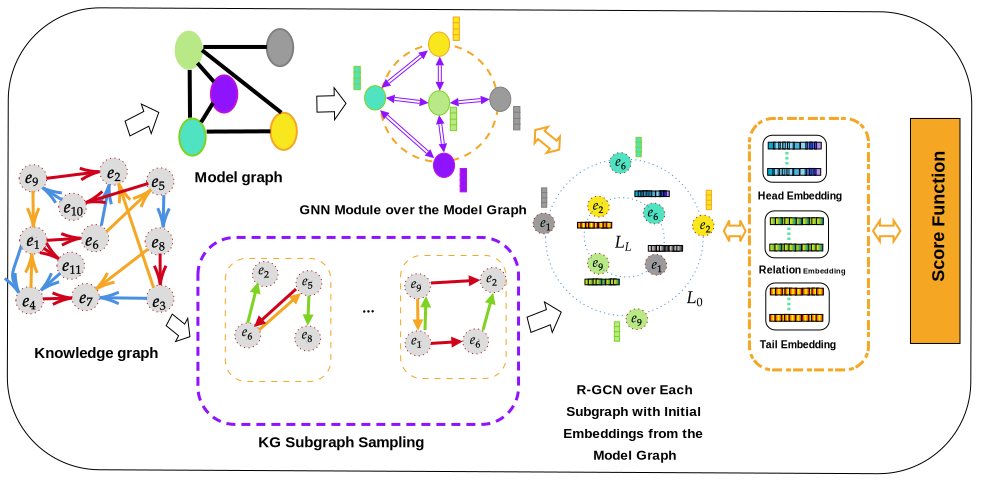
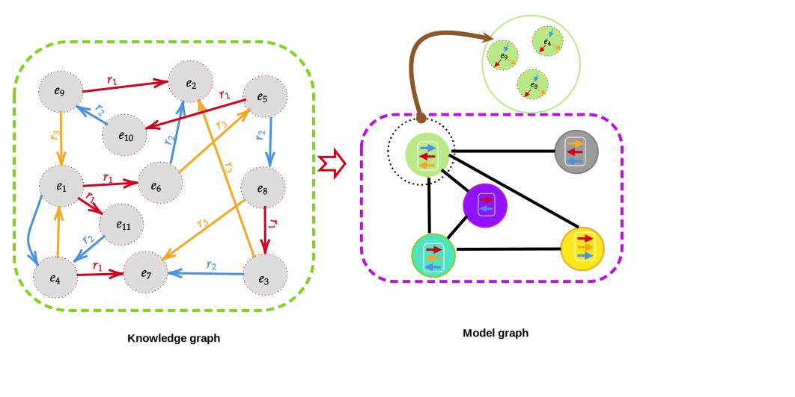
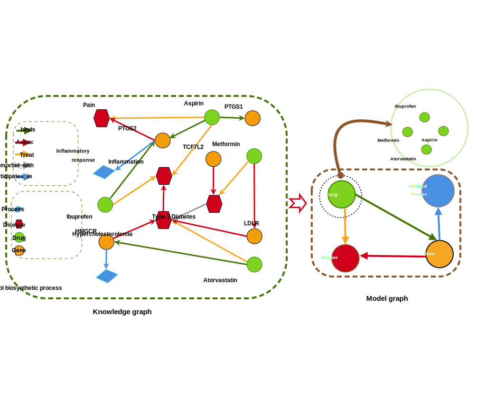

## Model Graph Inductive Learning (MGIL) for Knowledge Graph Completion

This repository contains the official implementation of the paper:

---

###  Overview

Link prediction in knowledge graphs relies heavily on high-quality embeddings. However, most existing approaches focus only on local neighborhood aggregation and ignore the global structure of the graph. To address this limitation, we propose **MGIL (Model Graph Inductive Learning)**, a novel framework that:

- Constructs a **model graph** from the original knowledge graph
- Captures **global structural patterns**
- Generates **high-quality initial embeddings** for entities

---
###  Key Idea

MGIL builds **two type model graphs** using two strategies:

#### 1. Relation-based Clustering
Entities are grouped based on the similarity of their:
- Incoming relations
- Outgoing relations

#### 2. Type-based Clustering
Entities are grouped based on their semantic types:
- Example: drugs, proteins, diseases

A **Graph Neural Network (GNN)** is then applied to the model graph to learn embeddings, which are transferred to the original graph.

---
### Framework Pipeline

1. Construct model graph (relation-based or type-based)
2. Apply GNN on the model graph
3. Generate global-aware embeddings
4. Initialize original KG embeddings
5. Perform link prediction
### Framework Overview


###  Model Graph Construction

#### Relation-based Model Graph


#### Entity-type Model Graph


###  Inductive Datasets

We evaluate MGIL on several widely-used and recently proposed inductive knowledge graph completion benchmarks:

- **FB15k-237**  
- **WN18RR**  
- **NELL-995**  

- **Shomer Inductive Benchmarks:**  
  - **CoDEx-M_E**  
  - **WN18RR_E**  
  - **HetioNet_E**

  ###  Usage

You can run the MGIL framework using the following command:

```bash
python main.py \
  --data_name codex_m_E \
  --name codex_m_E \
  --benchmark dataset/new_data \
  --model_graph_type relation_base
  Or
  python main.py \
  --name HetioNet_E\
  --data_name HetioNet_E \
  --model_graph_type entity_base


###  Citation

If you find this work useful, please cite:

```bibtex
@article{khani2025mgil,
  title={Model Graph Inductive Learning for Knowledge Graph Completion},
  author={Khani, Mohommad Esmaeil and Hasheminejad, Mahdieh and Taherkhani, Ali and Hajiabolhassan, Hosein},
  journal={},
  year={2025}
}
